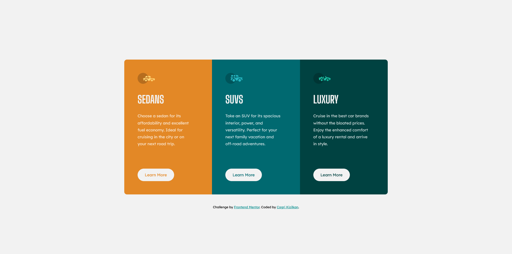

# Frontend Mentor - 3-column preview card component solution

This is a solution to the [3-column preview card component challenge on Frontend Mentor](https://www.frontendmentor.io/challenges/3column-preview-card-component-pH92eAR2-). Frontend Mentor challenges help you improve your coding skills by building realistic projects.

## Table of contents

- [Overview](#overview)
  - [The challenge](#the-challenge)
  - [Screenshot](#screenshot)
  - [Links](#links)
- [My process](#my-process)
  - [Built with](#built-with)
  - [What I learned](#what-i-learned)
- [Author](#author)

## Overview

### The challenge

Users should be able to:

- View the optimal layout depending on their device's screen size
- See hover states for interactive elements

### Screenshot




### Links

- Solution URL: [Frontend Mentor](https://www.frontendmentor.io/solutions/3column-preview-card-using-css-grid-and-mobilefirst-workflow-RjnXOKiqw5)
- Live Site URL: [3-Column Preview Card](https://cgrkzlkn.github.io/3-column-preview-card/)

## My process

### What I learned

Create a responsive grid layout using auto-fit in CSS Grid:

```css
.preview-cards {
  grid-template-columns: repeat(auto-fit, minmax(30rem, 1fr));
}
```

### Built with

- Semantic HTML5 Markup
- CSS Grid
- CSS Custom Properties
- Mobile-First Workflow

## Author

- Website - [Cagri Kizilkan](https://cagrikizilkan.com)
- Frontend Mentor - [@cgrkzlkn](https://www.frontendmentor.io/profile/cgrkzlkn)
- Twitter - [@cgrkzlkn](https://www.twitter.com/cgrkzlkn)
